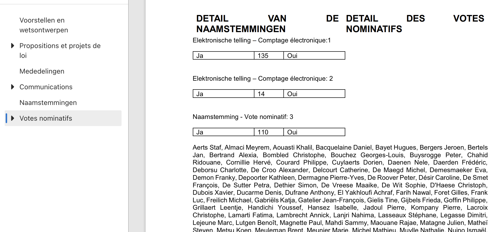
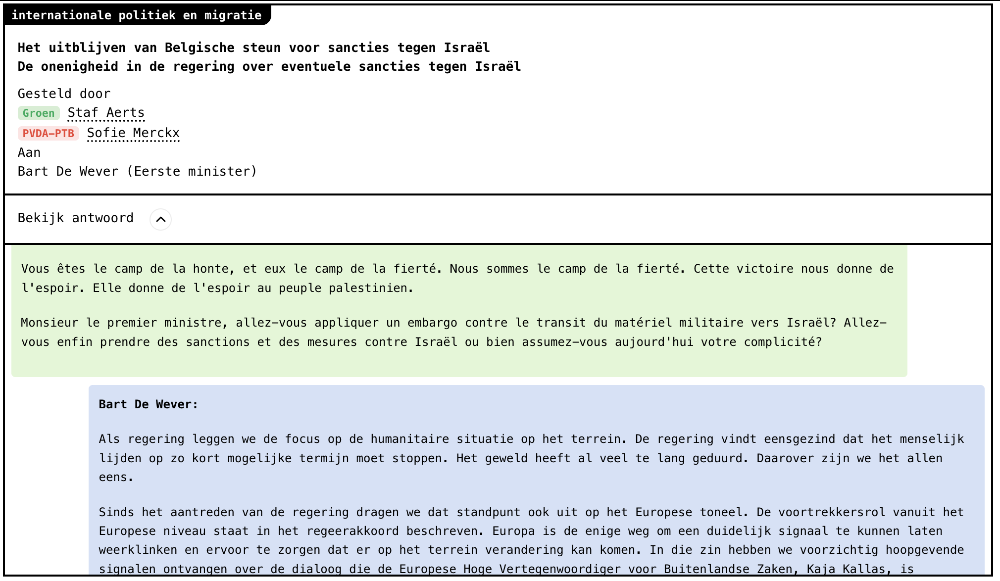
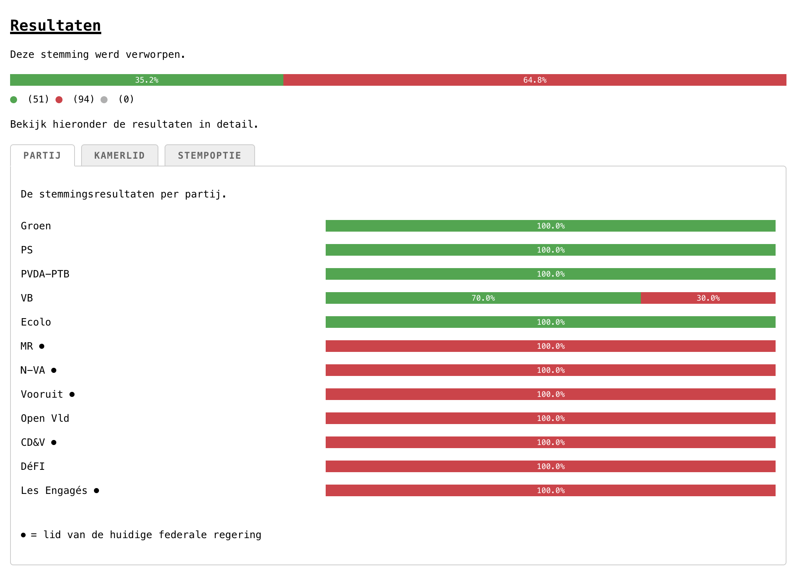
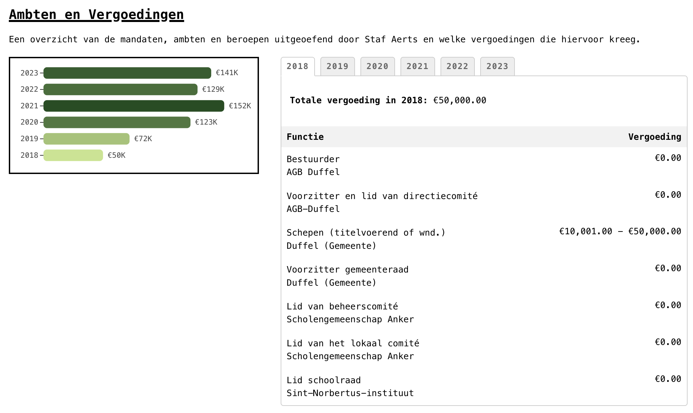
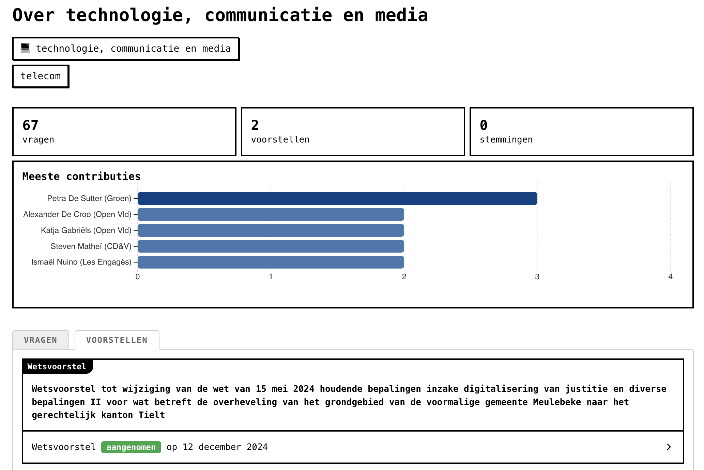
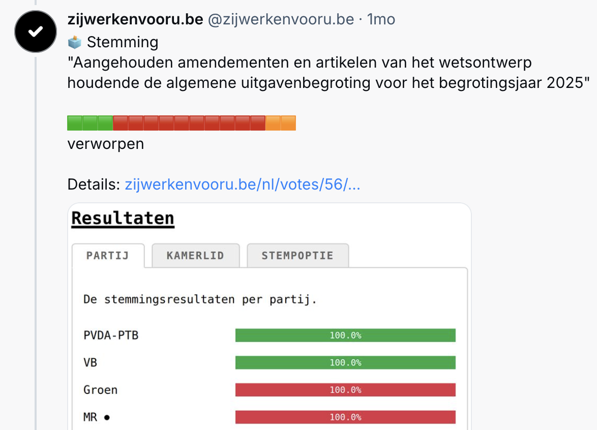

# `🗳️ zijwerkenvooru (they work for you)`

**How does the Belgian parliament vote?**

## ❓ About

This is a project that aims to improve transparency and accessibility of the voting history of the Belgian parliament.

### Why?

The official website of the Belgian parliament ([https://www.dekamer.be](https://www.dekamer.be)) has no straightforward way to view voting history of their members on various topics.

They publish a weekly report of the plenary session of that week. However:

- This document is often over 100 pages long which is difficult to process
- This document only contains the votes from that week's session which makes this the only view you have on voting data
- The chosen format (PDF or HTML) makes it impossible to interactively explore votes

Below is a small part of the report which shows a list of members that voted yes on a specific vote.

This project aims to turn this around and allow for the following questions to be easily answered:

- Which questions does member X ask?
- How does party X vote about topic Y?
- How much is member X paid?
- What's happening currently around topic X?

### How?

In a nutshell, the project does the following steps:

1. Scrapes HTML pages from official sources such as `https://www.dekamer.be`
2. Parses the HTML pages and extracts the relevant data
3. Transforms and stores the data in computer-friendly `.parquet` files
4. Uses the generated `.parquet` files to generate a website ([https://www.zijwerkenvooru.be](https://www.zijwerkenvooru.be)) that showcases different views of the data (votes, questions, dossiers etc.)

### Result

The final published website is available at [https://www.zijwerkenvooru.be](https://www.zijwerkenvooru.be).

Some features are shown below.

**Example 1. See questions asked during plenary sessions**

This shows who asked the questions and who answered, as well as the conversation.

**Example 2. See detailed voting results**

For each vote you can see a breakdown per-party or per-member.

**Example 3. Member remunerations**

For any member, see which functions they were paid for and how much they were paid for the past years.

**Example 4. See all propositions related to a topic**

By filtering on a topic you can see any parliamentary work that has been done related to that topic.

## 🏗️ Architecture

This repository consist of 4 components that are linked sequentially to build the final website.

### 1. Scraper

The scraper downloads and parses data from `dekamer.be` and `public.regimand.be`. It performs the following steps:

1. Downloads different HTML pages from `dekamer.be` and `public.regimand.be`
2. Caches the html pages under `/sources` to avoid unnecessary future downloads
3. Parses the HTML pages and extracts relevant data
4. Generates `.parquet` files using the extracted data

The end result of the scraper is a set of organized `.parquet` files that contain information about parliamentary members, votes, questions, dossiers, propositions etc.

The scraper code can be found in the `scraper` directory. It contains of the following subdirectories:

- `crawl`: A rust crate that helps with scraping
- `commission-scraper`: Rust project for scraping commission meeting data
- `plenary-scraper`: Rust project for scraping plenary meeting data
- `scrapers`: Collection of single-script scrapers (members, lobby, remunerations)
- `data/sources`: Collection of downloaded HTML pages (a cache to avoid unnecessary downloads)
- `current_commission_id.txt` and `current_plenary_id.txt`: For keeping track of the latest processed plenary and commission meetings, these are automatically updated

### 2. Summarizer

The summarizer is used to enrich the output of the scraper. It uses the Mistral API to perform summarization tasks.

Currently, the summarizer is only used to summarize plenary question topics into a single topic.

The summarizer is a Rust project and can be found in the `summarizer` directory.

### 3. Website (https://www.zijwerkenvooru.be)

The generated `.parquet` files are used to statically generate a website that provides an overview of the parliamentary activities.

For this, the `11ty/eleventy` framework is used. `DuckDB` is used to query the `.parquet` files. The output is a set of HTML pages that get hosted on `Cloudflare Pages`.

The project for the website can be found in the `web` directory.

### 4. Bluesky poster

The Bluesky poster is used to automatically create posts on Bluesky showing a summary of the most recent plenary session,

The poster is a Rust project and can be found in the `poster` directory.

## 🤖 GitHub Actions

There is a single GitHub Actions workflow for automatically scraping data, summarizing data, building and deploying the website and posting. It is run on a schedule or can be triggered manually.

## 🗃️ Data

The `parquet` files are published under the `web/src/data` directory. They include the following data files:

- `commission_questions.parquet` (questions asked during commission meetings)
- `commissions.parquet` (commission meetings)
- `dossiers.parquet` (dossiers)
- `lobby.parquet` (the lobbyregister)
- `meetings.parquet` (plenary meetings)
- `members.parquet` (members of parliament)
- `propositions.parquet` (propositions from during the plenary meeting)
- `questions.parquet` (questions asked during plenary meetings)
- `remunerations.parquet` (remunerations of members of parliament)
- `subdocuments.parquet` (subdocuments linked to dossiers)
- `summaries.parquet` (AI generated summaries of topics)
- `votes.parquet` (votes that happened during plenary meetings)

### Disclaimer

1. The data is collected on a best-effort basis. Completeness and correctness can not be guaranteed.
2. The data currently only covers the current session 56 (2024-2029). The scraper is capable of scraping older data as well, but this is currently not enabled. It's planned to enable this in the near future.

### Updates

The dataset is updated daily.

The dataset is also published on `https://data.gov.be/nl/datasets/datafederaalparlement`.

## 🛠️ Contributing

Please read our [Contributor Guide](CONTRIBUTING.md) for more information on how to get started.

## ✅ Future improvements

Only bug-fixes and some ad-hoc development is done for this project. Below is a list of future improvements that can be done:

**Improvements:**

- [ ] summarize dossier contents using Mistral
- [ ] add link to data.gov dataset
- [ ] scrape previous sessions (already supported but need to make sure there are no issues with this)
- [ ] French localization
- [ ] General UI/UX improvements
- [ ] Cleanup of chart code
- [ ] Do a spot check for data correctness

**Features:**

- [ ] Show number of questions over time
- [ ] More interesting member overview pages
- [ ] Add commission questions to member pages
- [ ] Add commission membership to member pages

**Fixes:**

- [ ] Document 56K0095 has incorrect date (1970)
